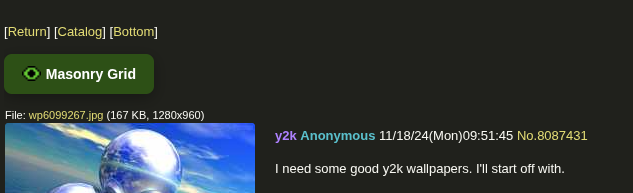
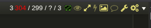

# 4chan-masonry
View all media (images+videos) from a 4chan thread in a masonry grid layout.

## Preview
By default, button is added on top of the thread.

If you have [4chan-x](https://github.com/ccd0/4chan-x), button gets added in the shortcuts bar.

### [ Click here to install ](https://github.com/0000xFFFF/4chan-masonry/raw/refs/heads/master/4chan-masonry.user.js)
