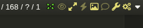

# 4chan-masonry
View all media (images+videos) from a 4chan thread in a masonry grid layout.

## Preview
By default, button is added on top of the thread.

If you have [4chan-x](https://github.com/ccd0/4chan-x), button gets added in the shortcuts bar.

### [ Click here to install ](https://github.com/0000xFFFF/4chan-masonry/raw/refs/heads/master/4chan-masonry.user.js)

### Notes:
* Images:
    * fetched with a priority queue.
    * thumbs are replaced with original images
    * if in viewport = medium priority
    * mouse hover = high priority
* Videos
    * to load videos simply hover on them and wait
    * max concurrent loading for videos is 1 also delay is high (to change modify global vars)
    * don't go overboard when loading videos to not get 429-ed by 4chan's rate limiter
